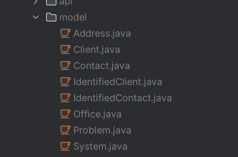

# openapi-generator
openapi-generator example

## issue
In our contract, we use $ref to point to shared models. If we use openapi:3.1.0 then it gives duplicate models in the java code we generate. For example, we have a Client.java and a Client1.java.
We have found that if we use $ref along with allOf: that we do not get duplicate models.

Is this a bug and is our use of allOf a correct solution?

# running code

```bash
cd tools/builders/openapi && npm install
```

```bash
cd tools/builders/openapi && npm  run generate:server
```

# result
Result is generated in a generated folder and generated double models in openapi:3.1:0 and not in openapi:3.0:0

## result for 3.1.0


## result for 3.0.0



